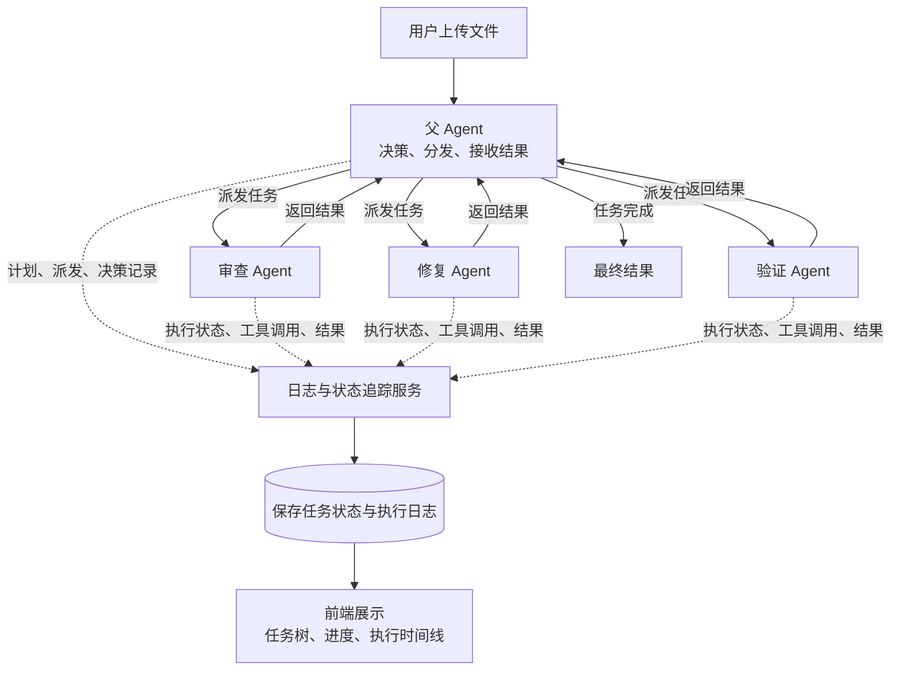
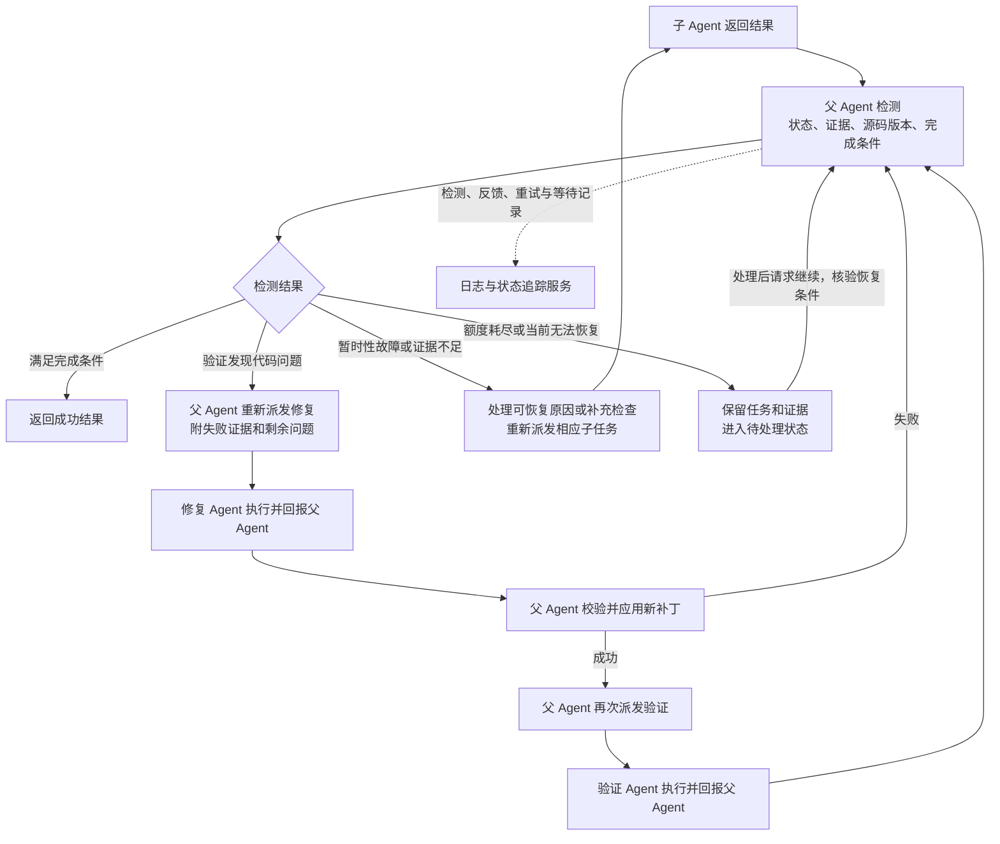
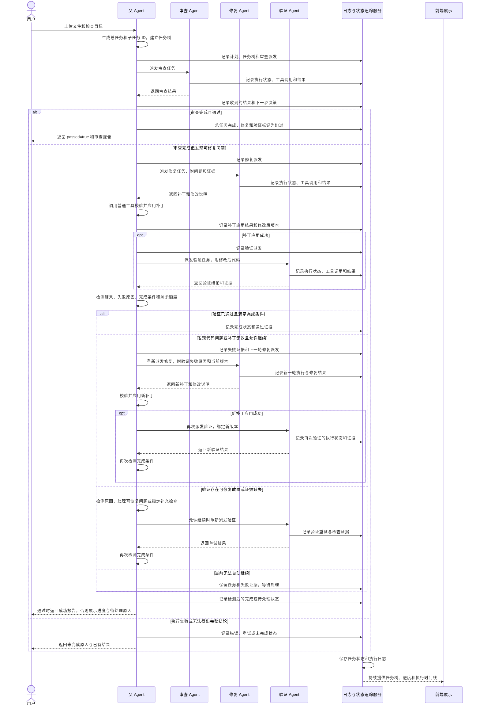
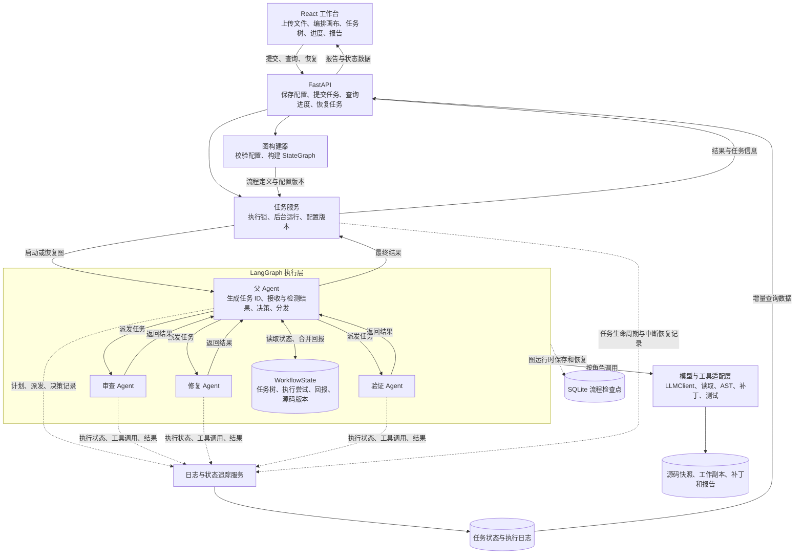
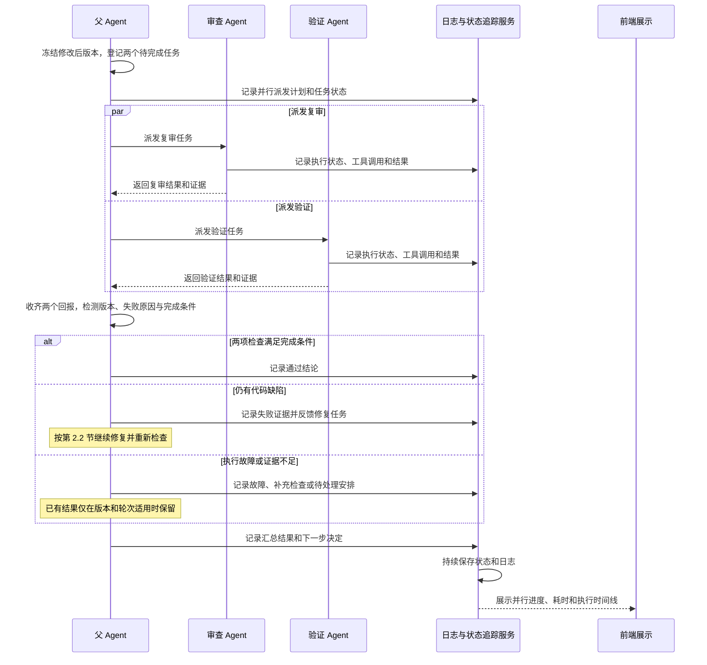
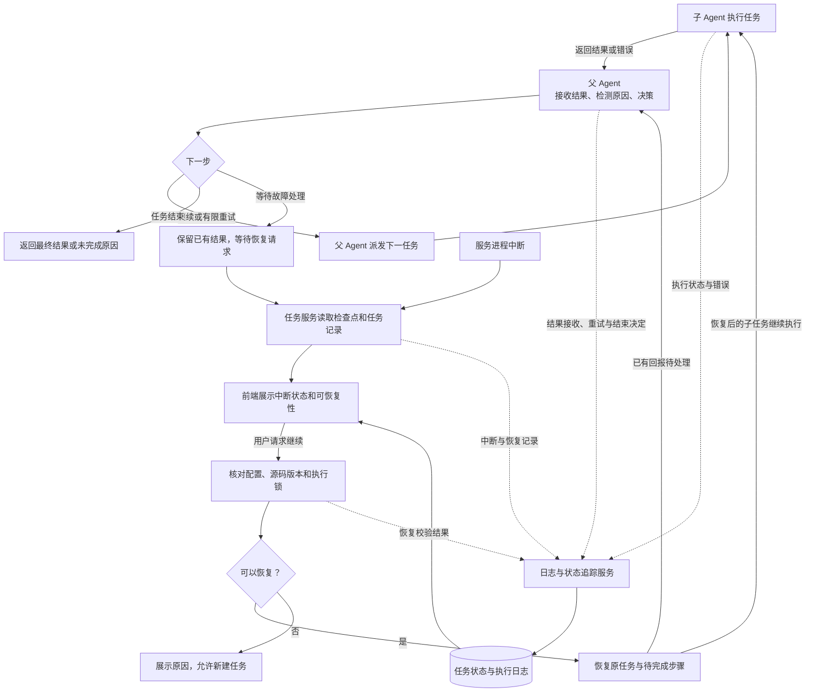

# Homework 2：父 Agent 与子任务 Workflow 架构

第 2 节“LangGraph 架构编排”为总览，其他流程图均按“父 Agent 派发、子 Agent 回报父 Agent、日志与状态追踪贯穿全程”的关系展开。

模块实现、字段关系、调用协议和使用约定见 [Desgin.md](Desgin.md)。

详细实施与验收见 [ImplementationPlan.md](ImplementationPlan.md)。检查合同、状态转移、各类预算、控制层超时终态和首版画布范围按该计划的明确规则实现，以下总览保持父 Agent 派发、接收和检测的统一关系。

## 1. 设计范围与基本约定

父 Agent 负责理解目标、提出结构化任务计划、解释子任务结果并选择下一步。ID 由父 Agent 执行生成，LangGraph 负责执行图、传递状态和持久化检查点；任务树、业务 ID、完成判定和派发协议由项目自己实现。LangGraph 并不会自动把请求拆成固定三个带业务 ID 的子任务。

基本流程：接收用户代码 → 由父 Agent 建立总任务和子任务 → 派发审查 → 父 Agent 接收审查结果 → 审查通过则提前结束，否则按需派发修复和验证。所有子 Agent 执行后都回报父 Agent，由父 Agent 决定后续动作。

修改在工作副本上进行。首次审查通过时允许结束，这表示本次约定审查通过，不表示未执行的测试也通过。已有的“修复后并行复审与验证”保留为扩展模式，不改变基础顺序模式的定义。

## 2. LangGraph 架构编排



父 Agent 根据需要调用子 Agent，收到结果后先检测完成条件和失败原因，再决定继续派发、重新执行或结束。实线表示任务派发、结果返回和数据流，虚线表示执行过程中产生的日志与状态记录。日志与状态追踪贯穿整个流程，由程序自动采集；每条记录关联总任务 ID、子任务 ID 和执行尝试 ID。前端展示任务树、进度和执行时间线，刷新后可以恢复查看。具体执行条件见第 2.1 节，父 Agent 检测机制见第 2.2 节，调用顺序见第 3 节，日志设计见第 6.2 节。

父 Agent 通过统一动作 dispatch_task 派发任务，携带 agent_id、task_kind、目标任务 ID、输入引用和理由；需要并行时使用 dispatch_batch，批量派发多个任务。审查、修复和验证是注册表中的不同能力，不为每个 Agent 单独增加派发指令。其他动作包括 apply_patch、wait_for_recovery、finish，由程序核验后执行。非法动作有限纠正，仍无效则记录错误并等待处理，不允许任意指令直接执行。finish 必须经过完成条件检测，不能仅凭子任务已返回就宣告成功。可扩展接口见第 7 节。

### 2.1 条件与结束规则

| 父 Agent 收到的结果 | 下一步 |
|---|---|
| 审查正常完成，passed=true，覆盖满足约定目标 | T102、T103 标记 skipped；总任务完成，passed=true |
| 审查正常完成，passed=false，有可修复问题 | 派发 T102，传入具体问题和证据 |
| 审查覆盖不完整或执行失败，passed=null | 有限重试或记录未完成，不能返回 true |
| 已证实存在问题且明确无法自动修复 | 经父控制层核验能力限制与证据后 completed/false，报告问题和原因；暂时阻塞或额度耗尽仍为 waiting_recovery |
| 修复返回有效候选补丁 | 父 Agent 请求普通应用节点校验和应用 |
| 补丁无效或无法匹配当前版本 | 父 Agent 检测失败原因，携带匹配错误重新派发修复；无法继续自动处理时保留任务等待恢复 |
| 补丁已成功应用 | 派发 T103，输入绑定修改后版本 |
| 验证完成且目标满足 | 总任务完成，passed=true，附修复和验证证据 |
| 验证完成但不通过 | 结果返回父 Agent；检测剩余缺陷与失败证据，重新派发修复，应用新补丁后再次验证；通过前不标记成功 |
| 验证超时、工具不可用或证据不足 | 结果返回父 Agent；检测是执行故障还是证据缺失，重试验证、补充检查或等待故障处理，恢复后继续原任务 |

默认每次自动执行最多两轮修复，另设验证重试、单 Agent 工具步数、模型重试和图执行步数上限。达到上限、重复补丁或代码无变化时，父 Agent 检测是否需要调整方案；仍不能自动继续则进入待处理状态，保留失败证据与下一步建议，处理后可继续原任务，不把停止自动重试视为成功完成。总任务的 passed 为 true / false / null：通过、不通过、无法得出完整结论。

总任务 status 使用 queued、running、waiting_recovery、completed、partial、failed、interrupted。需要继续但当前无法自动执行时为 waiting_recovery；已知仍有缺陷则保留 passed=false，结论不足则保留 passed=null。只有满足完成条件才返回 completed、passed=true；明确终止的未通过任务可为 completed、passed=false，证据不完整的终止任务可为 partial、passed=null。执行失败为 failed，进程中断为 interrupted。报告与页面同时展示执行状态和检查结论，避免把“子任务已结束”误认为“总目标已达到”。

首版只有 waiting_recovery/interrupted 可请求恢复或明确终止；completed、partial、failed 为最终态，不恢复。可恢复系统故障进入等待，确认不可恢复的执行故障才用 failed。终止与恢复竞争同一 revision 和执行权，运行中终止不在首版范围。终止时保留历史、证据及 false/null 区别，不把额度耗尽视为不可修复。

“覆盖满足约定目标”由版本化检查合同定义：每项检查具有目标、范围、方法、必需性、通过条件和证据要求；结果区分 passed/failed/not_run/inconclusive。必需目标不能在执行中被删除或降级。零测试、全部跳过和语法通过均不能替代行为验证；修改后必需目标由新版本证据重新覆盖。基础验证 Agent 可生成独立临时测试，使用实际执行证据验证修复，不依赖扩展角色；已接受的必需问题不能只凭修复声明关闭。

### 2.2 父 Agent 的检测与反馈机制

父 Agent 在每次接收回报后执行检测，形成“接收结果 → 检测 → 反馈 → 再派发”的闭环。检测包含可确定的程序校验与父 Agent 对失败原因、修复策略的分析，不能只读取一个布尔值。

| 检测内容 | 判定与动作 |
|---|---|
| 回报是否有效 | 核对 task_id、attempt_id、派发批次、源码版本和必需字段；过期或错误回报不参与当前判定 |
| 子任务是否真的完成 | 核对执行状态、工具实际输出和待回报集合；任务返回不等于通过 |
| 约定目标是否达到 | 检查目标问题、测试结果和覆盖范围；修复后必须有对应新版本的验证证据 |
| 是否存在代码缺陷 | 验证正常运行但失败，将失败测试、错误位置和剩余问题反馈修复 Agent，再验证 |
| 是否存在执行故障 | 超时、工具不可用等不直接作为代码缺陷；先处理可恢复原因，再派发验证 |
| 是否证据不足 | 指定缺失的检查、输入或覆盖范围，派发补充审查或验证，不盲目修改代码 |
| 是否还有进展与执行额度 | 比较补丁、源码版本、问题变化和失败签名；阻止无限重复，必要时等待处理后继续 |
| 是否存在失联或卡住任务 | 任务服务监测期限和执行心跳；超时后撤销旧尝试的有效性并记录故障，再按规则恢复，不能同时重试仍有效的旧尝试 |



下一轮修复输入包含原问题、失败验证输出、上一轮补丁、当前源码版本和明确修复目标。重新验证必须绑定最新已应用版本；基础设施恢复后的验证可以重用原版本，但记录新的执行尝试。恢复时保留累计历史与计数，由控制层授予明确的下一次执行额度，不通过重新进入父节点来悄悄重置上限。

## 3. 父子调用时序

本图展开第 2 节中的顺序执行路径。图中的日志消息由程序自动采集，任务 ID 和执行尝试字段见第 9 节。



所有子 Agent 的结果都返回父 Agent，子 Agent 之间没有直接派发关系。补丁应用属于父 Agent 调用的普通工具操作；补丁无效时先回到父 Agent 检测，再决定重新修复或等待处理。时序图展开一轮反馈示例，后续结果重复进入第 2.2 节的检测机制，不表示重试一次后自动成功。日志服务持续保存记录并供前端增量查询，图末的展示消息概括全程追踪，不表示必须等任务结束才写日志。

## 4. 模块对接与共享状态



本图在第 2 节的关系上补充前后端、运行状态和工具依赖。图中的父 Agent 包含派发校验与回报接收的程序控制层；这些逻辑由 LangGraph 节点和状态归并承载，不增加 Agent 角色。

WorkflowState 是运行时共享状态，SQLite 流程检查点用于恢复图执行；任务状态与执行日志用于查询、追踪和前端展示，文件产物保存源码与报告。它们用途不同。子 Agent 通过结构化回报交接，日志由程序采集，不直接随意改写公共数据库。图中的数据流表达模块关系，不表示每次读取状态都触发一次模型调用。

| State 字段 | 作用 |
|---|---|
| root_task_id、workflow_version | 总任务身份和固定编排版本 |
| goal、review_scope、acceptance_criteria、contract_version、acceptance_contract_ref | 用户目标、审查范围与冻结检查合同；局部说明不能放宽合同 |
| tasks、attempts | 三个逻辑子任务及其执行历史 |
| dispatch_batch_id、pending_attempt_ids | 本批派发编号、尚待回报的尝试 |
| received_results、processed_result_ids | 回报内容和已处理标识，避免重复消费 |
| workspace、source_versions | 副本、原始快照和当前源码版本 |
| findings、patches、verification | 审查问题、补丁、验证证据与产物引用 |
| repair_round、max_repair_rounds | 业务修复轮数与上限 |
| detection_result、feedback、next_action | 父 Agent 的检测结果、失败反馈与下一步安排 |
| verification_retry_count、max_verification_retries | 验证执行故障的重试计数与上限，与代码修复轮数分开 |
| status、passed、errors、report_ref | 总任务状态、判定、错误和报告 |

派发载荷至少包含 root_task_id、parent_task_id、task_id、attempt_id、dispatch_batch_id、目标、输入引用、源码版本和工具约束。回报至少包含同一组身份字段、执行状态、passed（适用时）、结果引用和错误信息。

父控制层核验回报与已派发尝试一致，再更新任务树和 pending 集合。过期轮次、错误版本或未知 attempt_id 的回报不得参与当前完成判定。并行分支各自返回结果，使用按 attempt_id 合并并去重的状态通道；只有父控制层更新总任务状态和下一步决策。

## 5. 并行扩展：修复后复审与验证

基础模式是三个子任务的按需顺序执行。启用并行检查模式后，父 Agent 在有效补丁应用后，额外创建一个复审子任务（示例 T104），由已有审查 Agent 执行；角色没有增加，但任务数量增加。



所有结果返回父 Agent；收集回报属于程序逻辑，模型只在本批结果完整后再次作决策。两边独立上下文、只读同一快照，不并发修改工作副本。日志与状态追踪分别记录两边的执行过程，前端展示时间区间重叠，证明真实并行。本图中的日志保存和展示持续发生，不阻塞子任务回报。

批次收齐以每个 attempt 的唯一合法终态为准，可来自 Agent 回报或控制层确认的故障。超时控制层在同一事务内失效旧 attempt、写 controller/failed 终态并关闭等待项；正常回报和超时处理竞争唯一终态。失效 Agent 的迟到回报只作审计，不能走控制层内部入口，不影响已接受结果。新批次只重跑故障分支，另一边证据须匹配当前源码、合同、检查器版本和测试摘要才能复用。

## 6. 推荐功能与错误恢复

### 6.1 可视化编排

- React Flow 展示父 Agent、派发、子 Agent、回报和结束路径；任务树展示实际任务与尝试，区分工作流节点、Agent 角色和业务 task_id。
- 支持已注册节点、允许的连线、修复轮数、工具超时和顺序 / 并行检查模式；保存配置后由后端校验构建图。
- 不允许子 Agent 绕过父节点直接派发下一个任务。校验输入依赖、回报路径、条件出口、循环上限和并行回报收齐条件。
- 每次运行固定配置版本，运行中的任务不随画布编辑改变。点击节点或任务查看输入、结果、证据、耗时及派发理由。

首版支持顺序/并行模板、已注册依赖插件的扩展角色和受限参数编辑，不支持任意连线执行。派发连接仅 parent→agent/tool，回报仅 agent/tool→parent，结束仅 parent→end 并经过完成检测；输入依赖单独表示。check_mode 以保存的 workflow_version 为准，提交时提供不同值返回配置冲突；默认值在保存时展开并固定。完整配置示例见 ImplementationPlan.md §14.1.1。

### 6.2 日志与状态追踪

- 事件关联 root_task_id、task_id、attempt_id、dispatch_batch_id、源码版本、事件序号和时间。
- 记录父 Agent 建立计划、生成 ID、派发指令、子任务开始结束、工具调用、子任务回报、父节点接收、跳过、重试、最终判定和恢复。
- 父 Agent、三个子 Agent 和任务服务的执行事件统一接入日志与状态追踪服务，按事件生成任务状态视图并持久化；该服务贯穿流程，不作为另一个 Agent，也不负责替父 Agent 派发任务。
- 基于 LangGraph 状态更新与自定义事件统一落库；前端通过 API 增量查询任务状态与执行日志，刷新后恢复任务树和时间线。数据库查询不直接触发模型运行。
- 记录实际执行摘要与证据，不记录模型私有思维过程。过滤密钥，长输出保存为产物引用；可导出 JSON 日志和 Markdown 报告。

### 6.3 错误处理与持久化恢复

| 情况 | 处理 |
|---|---|
| 请求超时、限流、暂时性服务错误 | 单处控制有限退避重试，避免多层重试叠加 |
| 父 Agent 调度指令或子 Agent 回报格式错误 | 结构化校验、有限纠正；仍无效则记录错误停止 |
| 补丁不匹配或语法无效 | 回报父 Agent，由其决定下一轮修复；不发布无效版本 |
| 测试正常完成但失败 | 子任务 completed、passed=false，回报父 Agent 检测后重新派发修复，再次验证 |
| 工具缺失、执行超时或检查覆盖不足 | passed=null，父 Agent 检测故障或缺失证据，重试验证、补充检查或等待恢复 |
| 服务中断 | 识别 interrupted 总任务，提供继续执行入口 |

使用持久化 SQLite 检查点，稳定 thread_id 与总任务关联；恢复时加载原配置、任务树、attempt 记录和源码快照。检查点位于图执行边界，中断的节点可能从头运行。

实现说明（2026-10-09）：提交接口经父控制层的 `initialize_task` 调用受控建任务工具，在事务中登记总任务、输入与提交幂等记录；API 不直接生成业务 ID。启动扫描后每 5 秒复查失效租约，快速重启时尚未过期的旧租约也会在过期后被识别；中断标记不自动续跑或追加额度。人工终止与正常收尾共用报告生成入口，保留已执行证据和缺失项。架构对照及回归证据见 [后端架构核查记录](docs/BackendArchitectureAudit-2026-10-09.md)。

补丁应用根据总任务、执行尝试、补丁内容和目标版本去重；已是预期修改后版本时返回已应用，版本冲突时停止。回报以 result_id 或 attempt_id 和产物摘要去重，不能重复递增完成数。单总任务执行锁防止同时启动两个恢复过程。



父 Agent 的正常决策依赖已收到的回报；进程中断时由任务服务从检查点恢复，不能要求已经停止的 Agent 主动回报。恢复后待执行的子任务继续运行并回报父 Agent，已经持久化但未处理的回报则直接交给父 Agent 处理；父 Agent 自身中断也通过原图检查点恢复。模型请求等暂时性错误可先在单个执行尝试内有限重试，耗尽后再向父节点返回失败。

只有具备可用检查点且故障可处理的任务显示恢复入口；输入错误等不可恢复问题直接返回原因。执行、中断、恢复、重试和最终判定都写入日志与状态追踪服务。测试也可能重跑，恢复不承诺回滚所有外部操作。

修复、验证故障、审查故障、修复故障和补充证据分别记账，默认值与服务端上限见 ImplementationPlan.md §9.4。新 fix attempt 总会消耗修复轮数，故障重派另消耗 fix 故障额度；同一 queued attempt 恢复不重复记账。恢复请求可显式追加各类额度，额度不足时拒绝并返回所缺许可，重启不自动授予新执行段。首版 resume 不更换源码、目标或测试输入，需补充材料时新建任务；原任务仍可恢复基础设施故障或明确终止。

## 7. 可扩展接口设计

本项目在 Test2 中独立实现父 Agent、三个子 Agent、工具层、工作台和任务服务，不引用、复制或依赖项目一的代码。Python、LangGraph、React、FastAPI 等作为本项目独立选用的技术栈。

扩展目标：新增遵循标准协议的 Agent 时，增加其实现、注册描述和流程配置，由父 Agent 统一派发并接收回报，已有子 Agent 的实现无需随之修改。共享数据库承担持久化，Agent 注册表与任务协议承担能力发现和调用。

### 7.1 Agent 执行接口与注册表

| 接口 | 职责 |
|---|---|
| AgentProtocol.execute(task: TaskEnvelope, context: AgentContext) → TaskResult | 异步执行一次子任务尝试，返回结构化结果 |
| AgentRegistry.register(spec: AgentSpec, implementation: AgentProtocol) | 登记角色描述和执行实现，校验标识、版本与输入输出协议 |
| AgentRegistry.list_capabilities() | 返回当前可用 Agent 及其能力，供父 Agent 制定计划和前端展示 |
| AgentRegistry.resolve(agent_id, version) | 根据派发目标找到已注册实现，拒绝未知或不可用角色 |
| AgentNodeAdapter.execute(task, context) | 将统一协议接入 LangGraph，校验输入输出、采集日志并返回状态更新 |

AgentSpec 包含 agent_id、version、description、supported_task_kinds、input_schema、output_schema、tool_names 和所需权限。能力描述明确输入要求、可产生产物和适用场景。注册表显式注册实现，不根据模型返回的名称执行任意导入或代码。

父 Agent 从注册表读取能力目录，使用统一 dispatch_task 或 dispatch_batch 动作选择执行者。派发前由控制层核验目标角色、输入依赖、任务权限和执行额度；LangGraph 图构建器按已启用注册项创建标准适配节点。新增标准 Agent 不要求另写一条专用的父 Agent 派发指令。

### 7.2 输入与返回协议

| 协议 | 核心字段 | 用途 |
|---|---|---|
| TaskEnvelope | schema_version、root_task_id、parent_task_id、task_id、attempt_id、dispatch_batch_id、agent_id、task_kind | 标识由谁派发、交给谁执行及本次尝试身份 |
| TaskEnvelope | goal、acceptance_criteria、input_refs、source_version、constraints | 指定目标、验收条件、输入证据、代码版本和执行约束 |
| TaskResult | schema_version、result_id、上述任务身份字段、source_version | 将回报准确关联到派发记录和对应版本 |
| TaskResult | status、passed、summary、result_refs、evidence_refs、error | 返回执行状态、业务结论、产物、证据及错误 |

审查、修复和验证的专用数据通过各自 input_schema、output_schema 校验，并保存在可引用的结构化产物中。统一信封保持稳定，新增 Agent 不必在共享 State 顶层无限增加专用字段。

工具实际结果与证据随 TaskResult 回报父 Agent，再由父 Agent 检测和决策。模型输出的 passed 不能绕过完成条件检测。修复任务等不适用布尔判定的任务保持 passed=null。

### 7.3 模型、工具与日志注入

AgentContext 提供模型客户端、工具访问接口、受限工作区、日志事件入口、超时和执行额度等运行依赖；这些对象不写入可序列化 State。可持久化的配置和版本引用保存在任务记录中，恢复时重新构建运行依赖。

- 模型接口：LLMClient 统一模型调用和结构化输出处理；每个 Agent 独立配置提示词、上下文和模型参数。
- 工具接口：ToolRegistry 登记工具描述、输入输出和权限；各 Agent 只获取其允许使用的工具。
- 日志接口：EventSink 统一记录任务开始结束、工具调用、错误和产物引用，自动补齐任务身份字段。
- 工作区接口：WorkspaceService 提供版本绑定的快照读取、产物保存和补丁应用，避免 Agent 自行跨目录读写。
- 控制接口：统一执行期限、取消信号与调用额度；新增 Agent 同样受限，不能绕过父 Agent 的恢复和重试规则。

### 7.4 新增 Agent 的接入步骤

1. 实现 AgentProtocol，定义该 Agent 的任务输入、结果产物和工具需求。
2. 添加 AgentSpec，登记 agent_id、版本、能力、输入输出 schema 和工具权限。
3. 在流程配置中启用注册项，声明所需输入、依赖、验收条件与顺序或并行安排。
4. 父 Agent 获得更新后的能力目录，建立相应子任务并通过统一动作派发。
5. AgentNodeAdapter 接收执行结果，统一写入日志并回报父 Agent；父 Agent 检测后决定后续动作。
6. 验证未知角色、输入缺失、错误版本和异常回报会被拒绝，并验证正常回报可以进入既有任务树和状态追踪。

例如新增测试生成 Agent，只需增加实现和注册项，声明代码快照输入、测试文件引用输出，并将验证任务的输入配置为这些测试文件。父 Agent 创建测试生成子任务，收到测试产物后再派发验证，审查和修复 Agent 的内部实现保持独立。

如果扩展引入全新的状态语义或外部操作，需要额外实现相应适配和完成判定，统一接口不会自动理解任意业务。每次运行固定 Agent 和协议版本，更新注册表不改变正在执行或等待恢复的旧任务。

## 8. 实现顺序与验收

1. 独立实现统一任务协议、Agent 注册表和 LangGraph 适配器，跑通总任务及三个子任务的派发与回报。
2. 验证首次审查通过：返回 passed=true，修复和验证显示 skipped。
3. 验证发现缺陷后的修复与验证：每次派发与回报可追溯到 task_id 和 attempt_id。
4. 实现父 Agent 检测机制：验证失败后反馈修复，执行故障后重试或恢复验证；核验失败证据进入下一轮输入，保留所有尝试历史。
5. 增加并行模式，证明同一快照、独立回报、收齐后才再次决策。
6. 接入日志、检查点和恢复，验证重复回报、重复补丁和重复恢复不会重复生效。
7. 接入基础可视化配置编辑，证明有效配置改变执行过程、非法连接被拒绝。
8. 验证通过新增注册项接入标准 Agent，统一派发、日志与回报正常生效；完成成功、业务不通过、执行失败、跳过、中断恢复等演示记录和使用文档。

评分对应：完整流程和明确结束规则对应流程完整性 40%；父子任务交接与状态合同对应 Agent 协作 30%；统一接口和注册表对应可扩展性 20%；架构、流程图和使用文档对应文档 10%。分数仍取决于实际实现与证据。

## 9. 总任务、子任务与执行尝试

```text
T100  总任务：按用户目标检查并按需修复指定项目
├── T101  审查任务 → 审查 Agent
├── T102  修复任务 → 修复 Agent，初始等待审查结果
└── T103  验证任务 → 验证 Agent，初始等待有效修复版本
```

ID 仅为示意，实际由父 Agent 执行生成唯一标识。三个子任务先登记，不表示同时执行，也不表示必须全部执行。

| 字段 | 含义 |
|---|---|
| root_task_id | 所属总任务，如 T100 |
| task_id、parent_task_id | 子任务编号、直接父任务编号 |
| agent_id、task_kind | 执行角色与任务类型，不等同于 task_id |
| depends_on | 依赖任务及其结果条件 |
| status | blocked、queued、running、completed、failed、skipped |
| attempt_id、attempt_no | 本次执行尝试的唯一编号与次数 |
| source_version | 本次尝试所检查或修改的源码版本 |
| input_refs、result_refs | 输入证据和输出产物引用 |
| passed | 审查或验证结论：true、false、null |
| error、skip_reason | 执行失败或跳过原因 |

status=completed 表示执行正常结束，不等于代码通过。审查或验证正常完成但发现缺陷时，status=completed、passed=false；系统错误导致无法得出结论时，status=failed、passed=null。修复任务主要返回补丁和生成结果，passed 不适用，保留 null。

再次修复时保留 T102、T103 的逻辑任务 ID，新增执行尝试记录，例如 T102-A2、T103-A2，完整保留第一轮记录。依赖必须指向本轮已应用补丁和对应源码版本，不能只检查“这个 task_id 曾经完成过”。

技术依据：[LangGraph Orchestrator-worker](https://docs.langchain.com/oss/python/langgraph/workflows-agents#orchestrator-worker)、[Graph API](https://docs.langchain.com/oss/python/langgraph/graph-api)、[Persistence](https://docs.langchain.com/oss/python/langgraph/persistence)、[Streaming](https://docs.langchain.com/oss/python/langgraph/streaming)、[React Flow](https://reactflow.dev/learn)。
